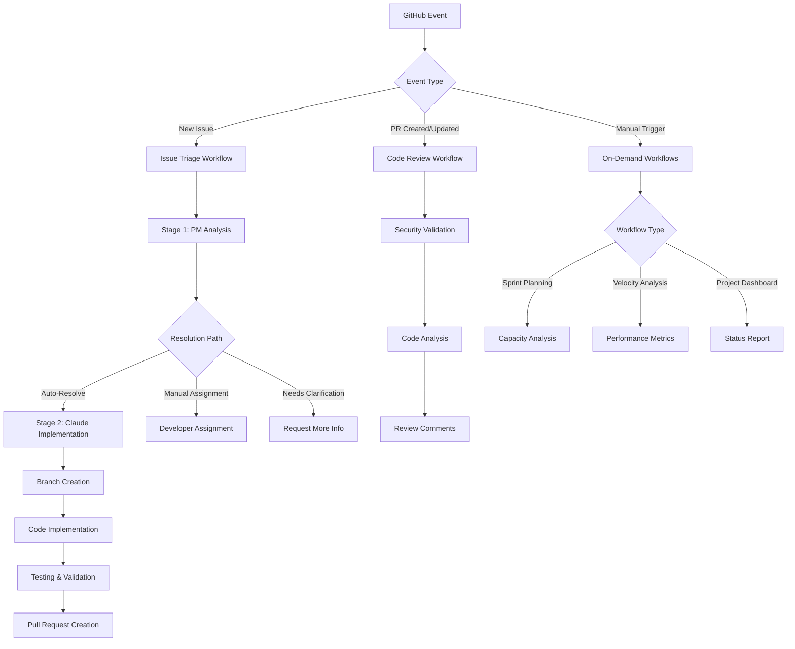

# Claude GitHub Actions Development Guide

This document provides comprehensive instructions for using Claude AI through GitHub Actions in this project for automated development workflows.

## 🔄 System Overview

The Claude GitHub Actions integration provides AI-powered assistance for:
- **Automated Issue Triage** - Smart categorization and priority assignment
- **Code Review** - Intelligent analysis and feedback on pull requests  
- **Project Management** - Sprint planning and milestone tracking
- **Performance Analytics** - On-demand project insights and metrics



## 🚀 Getting Started

### Prerequisites

1. **API Key Setup**: Ensure `ANTHROPIC_API_KEY` is configured in GitHub Secrets
2. **Permissions**: Repository must have Actions enabled
3. **Branch Protection**: Main branch should have appropriate protection rules

### Basic Usage Patterns

#### 1. **Issue-Driven Development**
When you create a new issue, the system automatically:
1. Analyzes the requirements
2. Determines complexity and priority
3. Chooses the appropriate resolution path
4. Either auto-implements or assigns to a contributor

#### 2. **Manual Workflow Triggers**
Navigate to **Actions** → Select workflow → **Run workflow**

## 📋 Workflow Reference

### 1. Issue Management (`claude-issue-management.yml`)

**Triggers**: New issues, issue comments, manual execution

**Stage 1: Project Manager Triage**
- Automatically triggered on new issues
- Analyzes technical requirements
- Assigns priority, effort, and resolution path
- Adds structured PM analysis comment

**Stage 2: Implementation**
- Auto-resolve path: Claude creates branch and implements
- Manual assignment: Routes to appropriate developer
- Clarification: Requests additional information

**Example Issue Creation:**
```markdown
# Bug Report: MCP Server Connection Timeout

The Super MCP server occasionally times out when processing large datasets.

## Expected Behavior
Server should handle datasets up to 100MB without timeout

## Current Behavior  
Connection drops after ~30 seconds on files >50MB

## Environment
- Go version: 1.24.4
- Dataset format: JSON
```

**AI Response Pattern:**
```markdown
## 📋 Project Manager Analysis

**Resolution Path**: Manual Assignment
**Estimated Effort**: Medium (3-5 days)
**Priority Level**: High
**Affected Components**: Connection handling, timeout configuration

### Technical Assessment
This requires investigating timeout settings in both the MCP server 
connection handler and the Super command execution. Potential solutions 
include configurable timeouts, streaming processing, or chunked data handling.

### Project Impact
High - affects core functionality for users with larger datasets

### Assignment Recommendations
Assign to contributor with Go networking experience. Should review
connection.go and timeout handling in main.go.
```

### 2. Code Review (`claude-code-review.yml`)

**Triggers**: Pull request creation/updates

**Review Focus Areas:**
- Go best practices and idioms
- Security vulnerabilities
- Performance implications
- MCP protocol compliance
- Test coverage

**Example PR Review Comment:**
```markdown
## 🔍 Code Review Analysis

### Security ✅
- No hardcoded credentials detected
- Input validation implemented properly

### Performance ⚠️
- Consider adding connection pooling for repeated Super command calls
- Large file processing could benefit from streaming (line 45-67)

### Code Quality ✅
- Follows Go conventions
- Error handling is comprehensive
- Documentation is clear

### Recommendations
1. Add timeout configuration to prevent hanging connections
2. Consider implementing circuit breaker pattern for Super command failures
3. Add integration test for large dataset scenario
```

### 3. Project Planning (`claude-project-planning.yml`)

**Available Actions:**
- `sprint` - Plan upcoming sprint with capacity analysis
- `milestone` - Analyze milestone progress and timeline
- `backlog_review` - Organize and prioritize backlog items

**Example Sprint Planning Prompt:**
```yaml
# Manual trigger example
planning_type: 'sprint'
```

**Generated Sprint Plan:**
```markdown
## 🚀 Sprint Plan - Sprint 12

### Sprint Goals
- Improve MCP server performance for large datasets
- Add comprehensive logging and monitoring
- Enhance error handling and recovery

### Capacity Analysis
- Available story points: 34
- Selected items: 32 points (94% capacity)
- Buffer time: 2 points for unexpected issues

### Sprint Backlog
1. **High Priority (14 points)**
   - Fix timeout issues with large files (#45) - 8 points
   - Add connection pooling (#46) - 6 points

2. **Medium Priority (12 points)**  
   - Implement structured logging (#38) - 5 points
   - Add health check endpoint (#41) - 4 points
   - Update documentation (#43) - 3 points

3. **Low Priority (6 points)**
   - Refactor error messages (#39) - 3 points
   - Add performance benchmarks (#42) - 3 points
```

### 4. Progress Tracking (`claude-progress-tracking.yml`)

**Available Reports:**
- `velocity_analysis` - Development velocity and trends
- `project_performance` - Contributor performance insights  
- `project_dashboard` - Executive project status

**Example Velocity Analysis:**
```yaml
# Manual trigger
report_type: 'velocity_analysis'
```

**Generated Analysis:**
```markdown
## 📈 Development Velocity Analysis

### Historical Trends (Last 6 Sprints)
- Average velocity: 28 story points
- Velocity trend: +15% improvement
- Completion rate: 87% (industry average: 75%)

### Productivity Factors
**Positive Factors:**
- Clear acceptance criteria increases velocity by 23%
- Proper issue labeling reduces triage time
- Automated testing catches issues early

**Impediments:**
- Large PRs take 2.3x longer to review
- Missing documentation slows implementation
- External dependency issues cause 18% of delays

### Predictive Insights
- Current milestone completion: Dec 15 (93% confidence)
- Optimal sprint size: 30-32 story points
- Risk factors: Holiday schedule may reduce capacity 20%

### Optimization Recommendations
1. Implement PR size limits (max 400 lines)
2. Add documentation templates for new features
3. Create dependency management checklist
```

## 🎯 Advanced Usage

### Custom Prompts for @claude Mentions

When mentioning `@claude` in issues or PRs, you can provide specific instructions:

**Code Implementation:**
```markdown
@claude Please implement the timeout configuration feature:
- Add timeout field to ServerConfig struct
- Make it configurable via environment variable
- Default to 30 seconds
- Add validation for reasonable timeout ranges
- Update documentation with new configuration option
```

**Code Review Request:**
```markdown
@claude Please review this PR with focus on:
- Memory usage patterns
- Error handling completeness  
- MCP protocol compliance
- Security implications of the new authentication flow
```

**Research and Analysis:**
```markdown
@claude Research the best practices for implementing connection pooling in Go MCP servers:
- Review existing patterns in the codebase
- Compare different pooling libraries
- Provide implementation recommendations
- Identify potential performance improvements
```

### Workflow Customization

#### Security Configuration
All workflows include security validation:

```yaml
- name: Security Validation
  env:
    ANTHROPIC_API_KEY: ${{ secrets.ANTHROPIC_API_KEY }}
  run: |
    if [ -z "$ANTHROPIC_API_KEY" ]; then
      echo "::error::API key not configured"
      exit 1
    fi
    echo "✅ Security checks passed"
```

#### Tool Restrictions
Claude's access is limited to specific tools for security:

```yaml
claude_args: |
  --allowedTools "Edit,Read,Write,View,Glob,Grep,Bash(gh:*),Bash(git:*),Bash(go:*)"
```

#### Custom Prompts
Modify workflow prompts to match your project needs:

```yaml
prompt: |
  # Custom Project Analysis
  
  Analyze this MCP server issue with focus on:
  - Super command integration patterns
  - Go performance optimization
  - MCP protocol compliance
  - Error handling robustness
```

## 🔧 Troubleshooting

### Common Issues

**1. Workflow Not Triggering**
- Check GitHub Actions are enabled
- Verify API key is set in repository secrets
- Ensure proper event triggers in workflow files

**2. Permission Errors**
```yaml
permissions:
  contents: read
  issues: write
  pull-requests: write
  id-token: write  # Required for Claude Code Action
```

**3. API Rate Limits**
- Workflows include automatic retry logic
- Large repositories may need staggered execution
- Consider using workflow concurrency controls

### Debug Information

Enable debug logging in workflows:
```yaml
env:
  ACTIONS_STEP_DEBUG: true
  ACTIONS_RUNNER_DEBUG: true
```

### Monitoring Workflow Performance

Check workflow execution in:
- **Actions** tab → Select workflow run
- Review execution time and resource usage
- Monitor API usage patterns

## 📊 Best Practices

### Issue Writing
```markdown
# Good Issue Example
## Summary
Clear one-sentence description of the problem or feature

## Technical Details  
- Specific error messages or behaviors
- Expected vs actual results
- Environment information

## Acceptance Criteria
- [ ] Testable requirement 1
- [ ] Testable requirement 2
- [ ] Documentation updated
```

### PR Guidelines
- Keep PRs focused and under 400 lines
- Include comprehensive test coverage
- Update documentation for new features
- Add clear commit messages

### Workflow Optimization
- Use specific labels for better categorization
- Provide detailed issue descriptions for better AI analysis
- Review and adjust workflow triggers based on team needs

## 🚀 Integration Examples

### CI/CD Integration
```yaml
# Example: Run tests before Claude analysis
- name: Run Tests
  run: |
    go test -v ./...
    go build -v .

- name: Claude Analysis
  if: success()
  uses: anthropics/claude-code-action@v1
```

### Custom Automation
```yaml
# Example: Auto-assign based on file changes
- name: Smart Assignment
  uses: anthropics/claude-code-action@v1
  with:
    prompt: |
      Analyze the changed files and suggest the best contributor
      for review based on:
      - File ownership patterns
      - Previous contribution history  
      - Expertise areas
```

## 📚 Additional Resources

- [Claude GitHub Actions Documentation](https://github.com/anthropics/claude-code-action)
- [MCP Protocol Specification](https://modelcontextprotocol.io/docs)
- [Super Data Tool](https://github.com/brimdata/super)
- [Go Best Practices](https://golang.org/doc/effective_go.html)

---

**Note**: This automation is designed to enhance development workflow, not replace human judgment. Always review AI-generated code and decisions before merging to production.